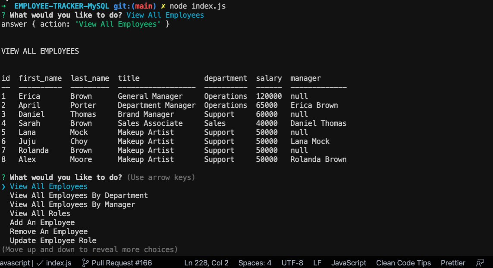
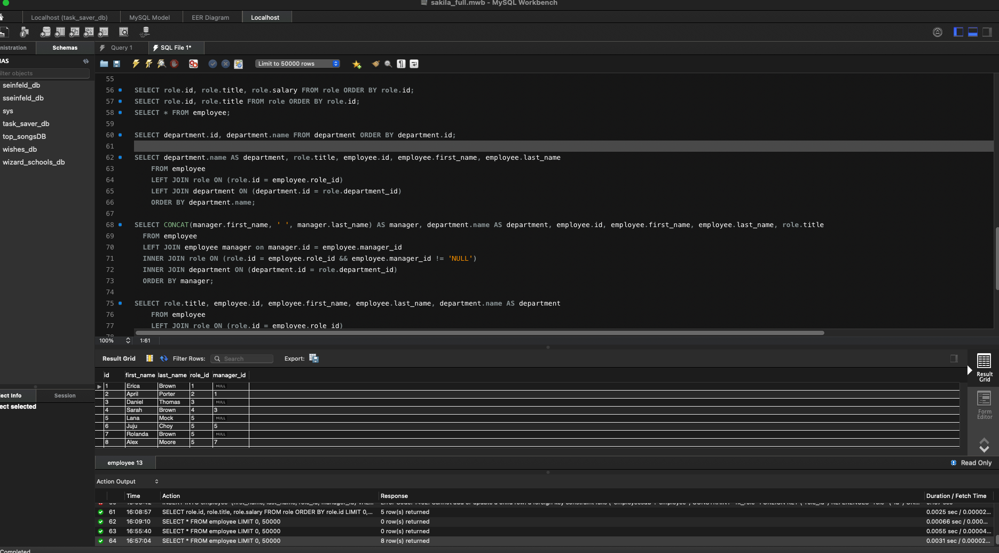

# EMPLOYEE-TRACKER-MySQL

# Unit 12 MySQL Homework: Employee Tracker


## DESCRIPTION
A command-line application that allows the user to:

  * Add departments, roles, employees

  * View departments, roles, employees

  * Update employee roles

  * Update employee managers

  * View employees by manager

  * Delete departments, roles, and employees
## USER STORY
```
As a business owner
I want to be able to view and manage the departments, roles, and employees in my company
So that I can organize and plan my business
```
## BUSINESS CONTEXT
Developers are often tasked with creating interfaces that make it easy for non-developers to view and interact with information stored in databases. Often these interfaces are known as **C**ontent **M**anagement **S**ystems. In this homework assignment, your challenge is to architect and build a solution for managing a company's employees using node, inquirer, and MySQL.

## SCREENSHOTS

The following animation demonstrates the application functionality:



## CLICK THE ICON BELOW: VIDEO DEMO LINK

[![VIDEO LINK]](https://drive.google.com/file/d/1f50F8O-9k8NITC6kPzom6TUnwOE2Ib5k/view)

## INSTALLATION

* ```npm init -y```
* ```npm install mysql inquirer```
* ```npm install console.table```
* ```mysql -u root -p```
If choosing to use from terminal, open terminal and run    
```node server.js```   


## DATABASE SCHEMA




* **department**:

  * **id** - INT PRIMARY KEY
  * **name** - VARCHAR(30) to hold department name

* **role**:

  * **id** - INT PRIMARY KEY
  * **title** -  VARCHAR(30) to hold role title
  * **salary** -  DECIMAL to hold role salary
  * **department_id** -  INT to hold reference to department role belongs to

* **employee**:

  * **id** - INT PRIMARY KEY
  * **first_name** - VARCHAR(30) to hold employee first name
  * **last_name** - VARCHAR(30) to hold employee last name
  * **role_id** - INT to hold reference to role employee has
  * **manager_id** - INT to hold reference to another employee that manages the employee being Created. This field may be null if the employee has no manager
  
## GitHub Repository & Deployed Site
*GitHub: [@danielthomas129](https://github.com/danielthomas129/EMPLOYEE-TRACKER-MySQL)
*[Github-Repository](https://github.com/danielthomas129/EMPLOYEE-TRACKER-MySQL)
*DEMO: [VIDEO-LINK](https://drive.google.com/file/d/1f50F8O-9k8NITC6kPzom6TUnwOE2Ib5k/view)
- - -

### Daniel Thomas Guadalupe
  
  ## Questions?
  
   
  
  For any questions, please contact me with the information below:
 
  GitHub: [@danielthomas129](https://api.github.com/users/danielthomas129)
